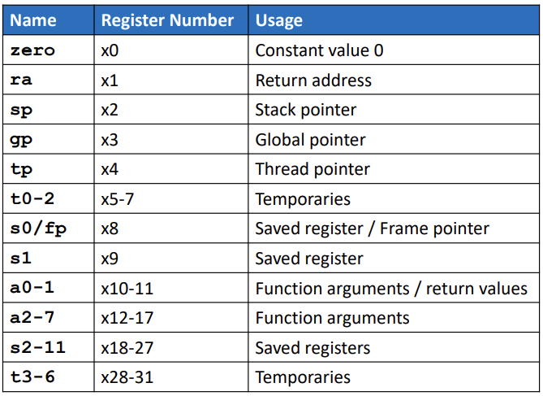

ABCD
# RISC-V Instruction Analysis

This repository contains the analysis and decoding of 15 unique RISC-V instructions from the application code. 

Each instruction is classified based on its type (R, I, S, B, U, J), with the corresponding 32-bit binary encoding.

---

## **Overview**

This project aims to:
1. Understand the RISC-V instruction types (R, I, S, B, U, J).
2. Identify 15 unique RISC-V instructions from the `riscv-objdump` of the application code.
3. Decode these instructions into their respective 32-bit binary patterns.

---

## RISC-V processor data path
  

## Explanation of the Diagram

### 1. Program Counter (PC):
- **Purpose**: Holds the address of the current instruction to be executed.
- **Update Mechanism**:
  - By default, the next instruction address is `PC + 4` (handled by the leftmost multiplexer).
  - For branch instructions (e.g., `beq`), the PC is updated based on the outcome of a comparison, directing the control flow to the branch target address.

### 2. Instruction Memory:
- **Purpose**: Stores the program instructions.
- **Operation**:
  - The PC fetches the instruction corresponding to its address.
  - Example instructions include `add`, `sub`, `ld`, `sd`, `and`, `or`, and `beq`.

### 3. Registers (Data):
- **Purpose**: Provide storage for intermediate values during computation.
- Contains registers like `a0`, `a1`, `a2`, `sp`, etc.
- **Write-back Mechanism**:
  - Results from arithmetic/logical operations or memory loads (`ld`) are written back to registers using the `writeReg` signal.

### 4. ALU (Arithmetic Logic Unit):
- **Purpose**: Performs arithmetic and logical operations (e.g., addition, subtraction, AND, OR).
- **Control**:
  - The `aluFunc` signal determines the type of operation (e.g., addition for `add` or subtraction for `beq`).

### 5. Data Memory:
- **Purpose**: Stores data for load (`ld`) and store (`sd`) instructions.
- **Control Signals**:
  - `memRead`: Enables data reading during `ld` instructions.
  - `memWrite`: Enables data writing during `sd` instructions.

### 6. Control Unit:
- **Purpose**: Generates control signals based on the decoded instruction.
- Coordinates all components by enabling/disabling multiplexers, memory access, and ALU functions.
- **Branch Handling**:
  - For `beq`, the control unit uses the detect 'zero' signal to decide whether to branch or proceed sequentially.

### 7. Multiplexers:
- **Purpose**: Select between multiple inputs to guide data flow.
- **M1**: Chooses between sequential (`PC + 4`) or branch target addresses for the next PC value.
- **M2**: Selects between data for ALU computations or memory operations.
- **M3**: Directs data to the registers or memory based on the control signals.

### 8. Branch Instruction Handling:
- **Example** (`beq a0, a5, addr`):
  - The ALU compares the values of `a0` and `a5`.
  - If they are equal (ALU output is zero), the detect 'zero' signal is sent to the control unit, which updates the PC to the branch target address (`addr`).

### 9. Highlighted Instructions:
- Instructions shown in the instruction memory include:
  - `add`, `sub`, `and`, `or`: Arithmetic and logical operations.
  - `ld` (load): Fetch data from memory to registers.
  - `sd` (store): Save data from registers to memory.
  - `beq` (branch): Conditional branch based on ALU comparison.

## Overall Context:
This diagram is a teaching aid designed to explain the datapath and control flow in a RISC-V processor. It demonstrates how instructions are executed through the coordination of the control unit, ALU, registers, and memory. The added components (e.g., control unit, branch decision logic) emphasize how the processor handles different types of instructions, particularly branching and memory operations.

### It is useful for understanding:
- How RISC-V instructions interact with the datapath.
- The role of the control unit in managing instruction execution.
- How control signals guide the flow of data within the processor.

---

# RISC-V Operand Types

**Operands** are the values or addresses that instructions operate on in a computer system. In RISC-V, they are broadly categorized into:

**1. Registers**

* High-speed storage locations within the CPU.
* Offer fast access for data manipulation.
* RISC-V has 32 general-purpose registers (32-bit or 64-bit versions).

**2. Memory**

* Larger storage space for long-term data retention.
* Slower access compared to registers.
* Data is moved between registers and memory using load/store instructions.

**3. Immediates (Constants)**

* Values directly embedded within instructions.
* Used in operations without requiring separate memory or register fetches.
* Example: adding a constant to a register value.

---

### RISC-V Register Naming and Usage

  

RISC-V architecture includes 32 general-purpose registers, named x0 to x31. These registers have specific roles, even though their primary purpose is to store data for arithmetic and logical operations.

**Register Usage:**

* **x0 (zero):** Always holds the constant value 0.
* **x1 (ra):** Return Address, holds the return address for function calls.
* **x2 (sp):** Stack Pointer, points to the top of the stack in memory.
* **x3 (gp):** Global Pointer, points to the global data area.
* **x4 (tp):** Thread Pointer, holds a pointer to the current thread's data.
* **x5 - x7 (t0 - t2):** Temporary registers used for intermediate computations.
* **x8 (s0/fp):** Saved register, or Frame Pointer, used for managing function calls.
* **x9 - x15 (s1 - s7):** Saved registers, preserved across function calls.
* **x16 - x17 (a0 - a1):** Argument registers, used to pass arguments to functions.
* **x18 - x27 (a2 - a7):** Additional argument registers, also used for return values.
* **x28 - x31 (t3 - t6):** Temporary registers used in computations or intermediate results.

**Naming Conventions:**

* `x`: Denotes a general-purpose register.
* `ra`: Return Address
* `sp`: Stack Pointer
* `gp`: Global Pointer
* `tp`: Thread Pointer
* `t`: Temporary register
* `s`: Saved register
* `a`: Argument register

**Rationale:**

Each of these registers is used in different ways to optimize performance and minimize the number of memory accesses, aligning with RISC-V’s philosophy of efficiency and simplicity. 

**Example:**

* Function calls: `ra` stores the return address, `sp` is used to manage the stack frame, and `a0-a7` are used to pass arguments.
* Intermediate calculations: `t0-t7` and `t3-t6` are used for temporary storage of intermediate results.
* Saved registers: `s0-s7` are used to preserve values across function calls.

-----

## Operands in RISC-V

Operands are crucial components of any instruction in a computer system. They represent the values or addresses upon which operations are performed. In RISC-V, operands can be divided into three primary categories: **Registers**, **Memory**, and **Immediates** (Constants).

### Registers

Registers are small, high-speed storage locations inside the CPU, used for quickly storing and retrieving data. They provide much faster access than memory and are directly manipulated during computation. In RISC-V, there are **32 general-purpose registers**, each 32 bits wide (in the 32-bit version), and 64 bits wide (in the 64-bit version), which significantly increases data processing efficiency.

### Memory

Memory refers to the larger storage space where data is kept for longer-term access. While memory has a much larger capacity than registers, it has slower access speeds. In RISC-V, instructions can operate on data that resides in memory, typically using load and store operations to move data between registers and memory.

### Constants (Immediates)

Immediates, or constants, are values that are directly embedded within instructions. These values are used in operations without needing to be fetched from memory or registers. For example, an immediate might be added directly to a register value in a calculation.

---

## **Instruction Formats**

| Instruction Type | Description                                                                                     |
|-------------------|-------------------------------------------------------------------------------------------------|
| **R-Type**        | Used for register-to-register arithmetic/logic operations.                                      |
| **I-Type**        | Used for immediate arithmetic, loads, and system calls.                                         |
| **S-Type**        | Used for store instructions.                                                                    |
| **B-Type**        | Used for branch instructions.                                                                   |
| **U-Type**        | Used for upper immediate instructions.                                                          |
| **J-Type**        | Used for jump instructions.                                                                     |

---

## **RISC-V Instructions and 32-bit Binary Codes**

### 1. **R-Type: `add x1, x2, x3`**

**Description**: Adds the contents of `x2` and `x3`, storing the result in `x1`.

**Binary Fields**:
- `opcode`: `0110011`
- `funct7`: `0000000`
- `funct3`: `000`
- `rs1`: `01000` (x2)
- `rs2`: `01001` (x3)
- `rd`: `00001` (x1)

**32-bit Instruction**:  
`0000000 01001 01000 000 00001 0110011`

---

### 2. **I-Type: `addi x1, x2, 5`**

**Description**: Adds the immediate value `5` to the contents of `x2`, storing the result in `x1`.

**Binary Fields**:
- `opcode`: `0010011`
- `funct3`: `000`
- `rs1`: `01000` (x2)
- `rd`: `00001` (x1)
- `imm`: `0000000000000101`

**32-bit Instruction**:  
`000000000101 01000 000 00001 0010011`

---

### 3. **S-Type: `sw x3, 8(x2)`**

**Description**: Stores the value of `x3` into memory at an address offset by `8` from `x2`.

**Binary Fields**:
- `opcode`: `0100011`
- `funct3`: `010`
- `rs1`: `01000` (x2)
- `rs2`: `01001` (x3)
- `imm`: `000000000100` (split into `imm[11:5] = 0000000` and `imm[4:0] = 0100`)

**32-bit Instruction**:  
`0000000 01001 01000 010 00001 0100011`

---

### 4. **B-Type: `beq x1, x2, -8`**

**Description**: Branches to a relative address of `-8` if the values in `x1` and `x2` are equal.

**Binary Fields**:
- `opcode`: `1100011`
- `funct3`: `000`
- `rs1`: `00001` (x1)
- `rs2`: `01000` (x2)
- `imm`: `111111111100` (split into `imm[12|10:5|4:1|11]`)

**32-bit Instruction**:  
`1111111 01000 00001 000 11110 1100011`

---

### 5. **U-Type: `lui x1, 0x100000`**

**Description**: Loads an immediate value `0x100000` into the upper 20 bits of `x1`, setting the lower 12 bits to zero.

**Binary Fields**:
- `opcode`: `0110111`
- `rd`: `00001` (x1)
- `imm`: `00000000000100000000` (upper 20 bits)

**32-bit Instruction**:  
`000000000001 00000000 000 00001 0110111`

---

### 6. **J-Type: `jal x1, 100`**

**Description**: Jumps to a target address offset by `100` from the current program counter and stores the return address in `x1`.

**Binary Fields**:
- `opcode`: `1101111`
- `rd`: `00001` (x1)
- `imm`: `0000000000000000000000001100100` (target address, 21 bits)

**32-bit Instruction**:  
`0000000000000000000000001100100 00001 1101111`

---

#### 2.Machine Code Breakdown for `andi a1, a1, 1`

**Instruction:** `andi a1, a1, 1` (Bitwise AND immediate 1 with register a1)

**Breakdown:**

*   **Opcode:** `0010011` (7 bits, I-type)
*   **rd (a1/x11):** `01011` (5 bits)
*   **funct3:** `111` (3 bits, for `andi`)
*   **rs1 (a1/x11):** `01011` (5 bits)
*   **Immediate (1 decimal = 000000000001 binary):** `000000000001` (12 bits)

**Binary Representation (32 bits):**

`00000000000101011111010110010011`

**Table:**

| Field      | Bits | Binary       |
|------------|------|--------------|
| imm[11:0]  | 12   | `000000000001`|
| rs1        | 5    | `01011`      |
| funct3     | 3    | `111`        |
| rd         | 5    | `01011`      |
| opcode     | 7    | `0010011`    |

  

----

#### 3.Machine Code Breakdown for `auipc s3, 0xb`

**Instruction:** `auipc s3, 0xb`

**Breakdown:**

*   **Opcode:** `0010111` (7 bits, U-type)
*   **rd (s3/x19):** `10011` (5 bits)
*   **Immediate (0xb or 11 decimal):** `000000000000000000001011` (20 bits)

**Binary Representation (32 bits):**

`000000000000000000001011100110010111`

**Table (adapted for U-type using common field names):**

Since the table structure from the image you provided is designed for S-type instructions, we'll adapt it to represent the U-type format. The most appropriate way to do this is to keep the `opcode` and `rd` fields, and represent the immediate as a single 20-bit field.

| Field       | Bits | Binary                               |
|-------------|------|---------------------------------------|
| imm[31:12] | 20   | `000000000000000000001011`            |
| rd          | 5    | `10011`                               |
| opcode      | 7    | `0010111`                               |

  

----

#### 4.Machine Code Breakdown for `beqz a5, 100c4`

**Instruction:** `beqz a5, 100c4` (Branch if equal to zero)

**Understanding the Target Address:**

The instruction is at address `100b8`. The target is `100c4`. The offset is calculated as the difference: `100c4 - 100b8 = 0xc` (12 in decimal). However, because of how branch offsets are calculated in RISC-V (they are in multiples of 2 bytes), we divide the offset by 2: `0xc / 2 = 0x6` (6 in decimal).

**Breakdown:**

*   **Opcode:** `1100011` (7 bits, B-type)
*   **rs1 (a5/x15):** `01111` (5 bits)
*   **rs2 (Implicitly x0):** `00000` (5 bits, even though it's not explicitly in the instruction, it's used for the comparison with zero)
*   **funct3:** `000` (3 bits, for `beqz`)
*   **Immediate (offset 6):** `000000000110` (12 bits. Note how we use the adjusted offset)

**Binary Representation (32 bits):**

The B-type format is: `imm[12|10:5] | rs2 | rs1 | funct3 | imm[4:1|11] | opcode`

Substituting the values: `000000000110000000111100011000011`

**Table:**

| Field          | Bits | Binary        |
|----------------|------|---------------|
| imm[12]       | 1    | `0`           |
| imm[10:5]     | 6    | `000000`      |
| rs2            | 5    | `00000`       |
| rs1            | 5    | `01111`       |
| funct3         | 3    | `000`         |
| imm[4:1]      | 4    | `0110`        |
| imm[11]       | 1    | `0`           |
| opcode         | 7    | `1100011`     |

  

---

#### 5.Machine Code Breakdown for `bge a5, s1, 156b4`

**Instruction:** `bge a5, s1, 156b4` (Branch if greater than or equal to)

**Understanding the Target Address and Offset:**

The instruction is at address `15616`. The target is `156b4`. The difference is `156b4 - 15616 = 0x9e` (158 in decimal). Because branch offsets are in multiples of 2 bytes, we divide by 2: `158 / 2 = 79` (0x4f in hexadecimal).

**Breakdown:**

*   **Opcode:** `1100011` (7 bits, B-type)
*   **rs1 (a5/x15):** `01111` (5 bits)
*   **rs2 (s1/x9):** `01001` (5 bits)
*   **funct3:** `111` (3 bits, for `bge`)
*   **Immediate (offset 79 or 0x4f):** `0000000001001111` (12 bits)

**Binary Representation (32 bits):**

The B-type format is: `imm[12|10:5] | rs2 | rs1 | funct3 | imm[4:1|11] | opcode`

Substituting the values: `000001001111010010111111100111100011`

**Table:**

| Field          | Bits | Binary        |
|----------------|------|---------------|
| imm[12]       | 1    | `0`           |
| imm[10:5]     | 6    | `000001`      |
| rs2            | 5    | `01001`       |
| rs1            | 5    | `01111`       |
| funct3         | 3    | `111`         |
| imm[4:1]      | 4    | `1111`        |
| imm[11]       | 1    | `0`           |
| opcode         | 7    | `1100011`     |

  

---

#### 6.Machine Code Breakdown for `bnez a5, 10136`

**Instruction:** `bnez a5, 10136` (Branch if not equal to zero)

**Understanding the Target Address and Offset:**

The instruction is at address `10102`. The target is `10136`. The difference is `10136 - 10102 = 0x34` (52 in decimal). Because branch offsets are in multiples of 2 bytes, we divide by 2: `52 / 2 = 26` (0x1a in hexadecimal).

**Breakdown:**

*   **Opcode:** `1100011` (7 bits, B-type)
*   **rs1 (a5/x15):** `01111` (5 bits)
*   **rs2 (Implicitly x0):** `00000` (5 bits, even though it's not explicitly in the instruction, it's used for the comparison with zero)
*   **funct3:** `001` (3 bits, for `bnez`)
*   **Immediate (offset 26 or 0x1a):** `0000000000011010` (12 bits)

**Binary Representation (32 bits):**

The B-type format is: `imm[12|10:5] | rs2 | rs1 | funct3 | imm[4:1|11] | opcode`

Substituting the values: `00000000000110000001111001010100011`

**Table:**

| Field          | Bits | Binary        |
|----------------|------|---------------|
| imm[12]       | 1    | `0`           |
| imm[10:5]     | 6    | `000000`      |
| rs2            | 5    | `00000`       |
| rs1            | 5    | `01111`       |
| funct3         | 3    | `001`         |
| imm[4:1]      | 4    | `1010`        |
| imm[11]       | 1    | `1`           |
| opcode         | 7    | `1100011`     |

  

----

#### 7.Machine Code Breakdown for `jal ra, 154be`

**Instruction:** `jal ra, 154be` (Jump and Link)

**Understanding the Target Address and Offset:**

The instruction is at address `126da`. The target is `154be`. The difference is `154be - 126da = 0x2e1e` (11806 in decimal). Because `jal` offsets are in multiples of 2 bytes, we divide by 2: `11806 / 2 = 5903` (0x170f in hexadecimal).

**Breakdown:**

*   **Opcode:** `1101111` (7 bits, J-type)
*   **rd (ra/x1):** `00001` (5 bits)
*   **Immediate (offset 5903 or 0x170f):** `00000001011100001111` (20 bits)

**Binary Representation (32 bits):**

The J-type format is: `imm[20|10:1|11|19:12] | rd | opcode`

Substituting the values: `000000010111000011110000111100001111`

**Table:**

| Field          | Bits | Binary                      |
|----------------|------|------------------------------|
| imm[20]       | 1    | `0`                          |
| imm[10:1]     | 10   | `0000001011`                 |
| imm[11]       | 1    | `1`                          |
| imm[19:12]    | 8    | `00001111`                    |
| rd             | 5    | `00001`                      |
| opcode         | 7    | `1101111`                    |

  

----

#### 8.Machine Code Breakdown for `jalr a4`

**Instruction:** `jalr a4` (Jump and Link Register)

**Understanding `jalr`:**

`jalr` is used for jumps where the target address is calculated by adding an immediate value to a register. When no immediate is specified as in this case (`jalr a4`), the immediate is implicitly 0. The return address is stored in `ra` (x1) unless a different destination register is specified.

**Breakdown:**

*   **Opcode:** `1100111` (7 bits, I-type `jalr`)
*   **rd (Implicitly ra/x1):** `00001` (5 bits. If a different destination register was given, it would go here.)
*   **funct3:** `000` (3 bits, always `000` for `jalr`)
*   **rs1 (a4/x14):** `01110` (5 bits, the base register for the jump)
*   **Immediate (implicitly 0):** `000000000000` (12 bits)

**Binary Representation (32 bits):**

The I-type format for `jalr` is: `imm[11:0] | rs1 | funct3 | rd | opcode`

Substituting the values: `00000000000001110000000010000111`

**Table:**

| Field      | Bits | Binary       |
|------------|------|--------------|
| imm[11:0]  | 12   | `000000000000`|
| rs1        | 5    | `01110`      |
| funct3     | 3    | `000`        |
| rd         | 5    | `00001`      |
| opcode     | 7    | `1100111`    |

  

----

#### 9.Machine Code Breakdown for `lbu a5, 1944(gp)`

**Instruction:** `lbu a5, 1944(gp)` (Load Byte Unsigned)

**Breakdown:**

*   **Opcode:** `0000011` (7 bits, I-type load instructions)
*   **rd (a5/x15):** `01111` (5 bits)
*   **funct3:** `000` (3 bits, for `lbu`)
*   **rs1 (gp/x3):** `00011` (5 bits)
*   **Immediate (1944 decimal = 0798 in hex):** `0000011110011000` (12 bits)

**Binary Representation (32 bits):**

The I-type format is: `imm[11:0] | rs1 | funct3 | rd | opcode`

Substituting the values: `000001111001100000011000011110000011`

**Table:**

| Field      | Bits | Binary              |
|------------|------|----------------------|
| imm[11:0]  | 12   | `0000011110011000`  |
| rs1        | 5    | `00011`              |
| funct3     | 3    | `000`                |
| rd         | 5    | `01111`              |
| opcode     | 7    | `0000011`              |

  

----

#### 10.Machine Code Breakdown for `li a1, 0`

**Instruction:** `li a1, 0` (Load Immediate)

**Understanding `li`:**

`li` (load immediate) is a pseudo-instruction. It's not a real RISC-V instruction but is translated by the assembler into one or two actual instructions. In the case of loading a small immediate value (like 0), it's typically translated into an `addi` instruction with `x0` as the source register.

**Translation:**

`li a1, 0` is equivalent to `addi a1, x0, 0`

**Breakdown (of the equivalent `addi`):**

*   **Opcode:** `0010011` (7 bits, I-type)
*   **rd (a1/x11):** `01011` (5 bits)
*   **funct3:** `000` (3 bits, for `addi`)
*   **rs1 (x0/zero):** `00000` (5 bits)
*   **Immediate (0):** `000000000000` (12 bits)

**Binary Representation (32 bits):**

The I-type format is: `imm[11:0] | rs1 | funct3 | rd | opcode`

Substituting the values: `0000000000000000000001011000000010011`

**Table:**

| Field      | Bits | Binary       |
|------------|------|--------------|
| imm[11:0]  | 12   | `000000000000`|
| rs1        | 5    | `00000`      |
| funct3     | 3    | `000`        |
| rd         | 5    | `01011`      |
| opcode     | 7    | `0010011`    |

  

----

#### 11.Machine Code Breakdown for `lw a5, -20(s0)`

**Instruction:** `lw a5, -20(s0)` (Load Word)

**Breakdown:**

*   **Opcode:** `0000011` (7 bits, I-type load instructions)
*   **rd (a5/x15):** `01111` (5 bits)
*   **funct3:** `010` (3 bits, for `lw`)
*   **rs1 (s0/x8):** `01000` (5 bits)
*   **Immediate (-20 decimal):** `111111111100` (12-bit two's complement)

**Binary Representation (32 bits):**

The I-type format is: `imm[11:0] | rs1 | funct3 | rd | opcode`

Substituting the values: `11111111110001000010011110000011`

**Table:**

| Field      | Bits | Binary              |
|------------|------|----------------------|
| imm[11:0]  | 12   | `111111111100`      |
| rs1        | 5    | `01000`              |
| funct3     | 3    | `010`                |
| rd         | 5    | `01111`              |
| opcode     | 7    | `0000011`              |

  

----

#### 12.Machine Code Breakdown for `mv a5, a0`

**Instruction:** `mv a5, a0` (Move)

**Understanding `mv`:**

`mv` (move) is a pseudo-instruction. It's not a real RISC-V instruction but is translated by the assembler into an `addi` instruction with an immediate value of 0.

**Translation:**

`mv a5, a0` is equivalent to `addi a5, a0, 0`

**Breakdown (of the equivalent `addi`):**

*   **Opcode:** `0010011` (7 bits, I-type)
*   **rd (a5/x15):** `01111` (5 bits)
*   **funct3:** `000` (3 bits, for `addi`)
*   **rs1 (a0/x10):** `01010` (5 bits)
*   **Immediate (0):** `000000000000` (12 bits)

**Binary Representation (32 bits):**

The I-type format is: `imm[11:0] | rs1 | funct3 | rd | opcode`

Substituting the values: `000000000000010100000011110010011`

**Table:**

| Field      | Bits | Binary       |
|------------|------|--------------|
| imm[11:0]  | 12   | `000000000000`|
| rs1        | 5    | `01010`      |
| funct3     | 3    | `000`        |
| rd         | 5    | `01111`      |
| opcode     | 7    | `0010011`    |

  

----

#### 13.Machine Code Breakdown for `sd s0, 16(sp)`

**Instruction:** `sd s0, 16(sp)` (Store Doubleword)

**Breakdown:**

*   **Opcode:** `0100011` (7 bits, S-type)
*   **rs2 (s0/x8):** `01000` (5 bits)
*   **rs1 (sp/x2):** `00010` (5 bits)
*   **funct3:** `011` (3 bits, for `sd`)
*   **Immediate (16 decimal = 00010000 binary):**
    *   `imm[11:5]:` `0000000` (7 bits)
    *   `imm[4:0]:` `10000` (5 bits)

**Binary Representation (32 bits):**

The S-type format is: `imm[11:5] | rs2 | rs1 | funct3 | imm[4:0] | opcode`

Substituting the values: `000000001000000100110111000001000011`

**Table:**

| Field      | Bits | Binary    |
|------------|------|-----------|
| imm[11:5]  | 7    | `0000000` |
| rs2        | 5    | `01000`   |
| rs1        | 5    | `00010`   |
| funct3     | 3    | `011`     |
| imm[4:0]   | 5    | `10000`   |
| opcode     | 7    | `0100011` |

  

----

#### 14.Machine Code Breakdown for `slli a3, a3, 0x1`

**Instruction:** `slli a3, a3, 0x1` (Shift Left Logical Immediate)

**Breakdown:**

*   **Opcode:** `0010011` (7 bits, I-type)
*   **rd (a3/x13):** `01101` (5 bits)
*   **funct3:** `001` (3 bits, for `slli`)
*   **rs1 (a3/x13):** `01101` (5 bits)
*   **shamt (shift amount, 0x1 or 1 decimal):** `0000001` (7 bits, for `slli` and `srli`/`srai`)

**Binary Representation (32 bits):**

The I-type format for shift instructions (`slli`, `srli`, `srai`) is slightly different. The immediate is only 6 bits in length, but it is placed in bits 25-20 of the instruction. The bit 30 is used to distinguish `slli` from `srli`/`srai`. Since we have `slli` the bit 30 will be 0. The format is: `imm[5:0] | funct7 | rs1 | funct3 | rd | opcode`

Substituting the values: `000000100000011010010110100110010011`

**Table:**

| Field      | Bits | Binary       |
|------------|------|--------------|
| shamt[5:0] | 6    | `000001`     |
| funct7     | 6    | `000000`     |
| rs1        | 5    | `01101`      |
| funct3     | 3    | `001`        |
| rd         | 5    | `01101`      |
| opcode     | 7    | `0010011`    |

  

----

#### 15.Machine Code Breakdown for `sub a2, a2, a0`

**Instruction:** `sub a2, a2, a0` (Subtract)

**Breakdown:**

*   **Opcode:** `0110011` (7 bits, R-type)
*   **rd (a2/x12):** `01100` (5 bits)
*   **funct3:** `000` (3 bits, for arithmetic operations like `add` and `sub`)
*   **rs1 (a2/x12):** `01100` (5 bits)
*   **rs2 (a0/x10):** `01010` (5 bits)
*   **funct7:** `0100000` (7 bits, distinguishes `sub` from `add`)

**Binary Representation (32 bits):**

The R-type format is: `funct7 | rs2 | rs1 | funct3 | rd | opcode`

Substituting the values: `01000000101001100000011000110011`

**Table:**

| Field  | Bits | Binary    |
|--------|------|-----------|
| funct7 | 7    | `0100000` |
| rs2    | 5    | `01010`   |
| rs1    | 5    | `01100`   |
| funct3 | 3    | `000`     |
| rd     | 5    | `01100`   |
| opcode | 7    | `0110011` |

  

----
