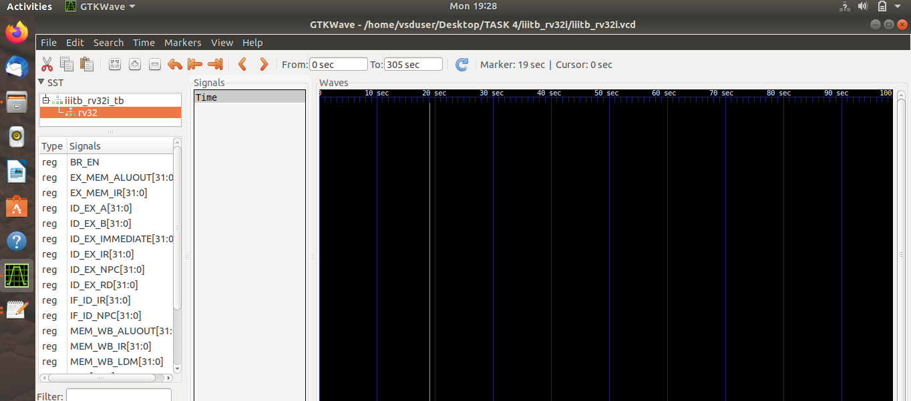
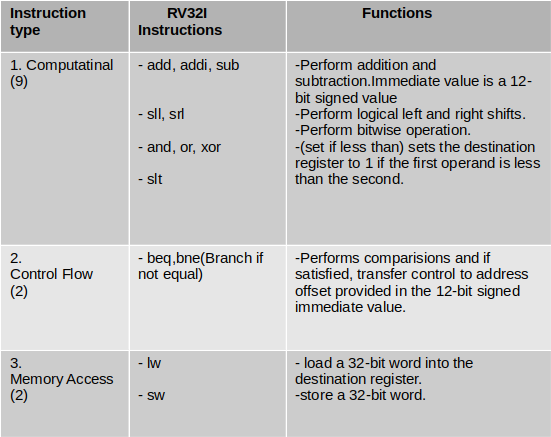
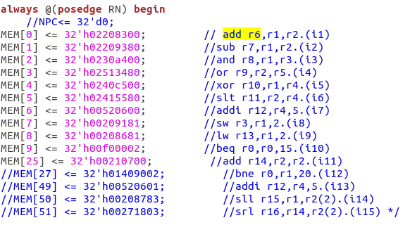
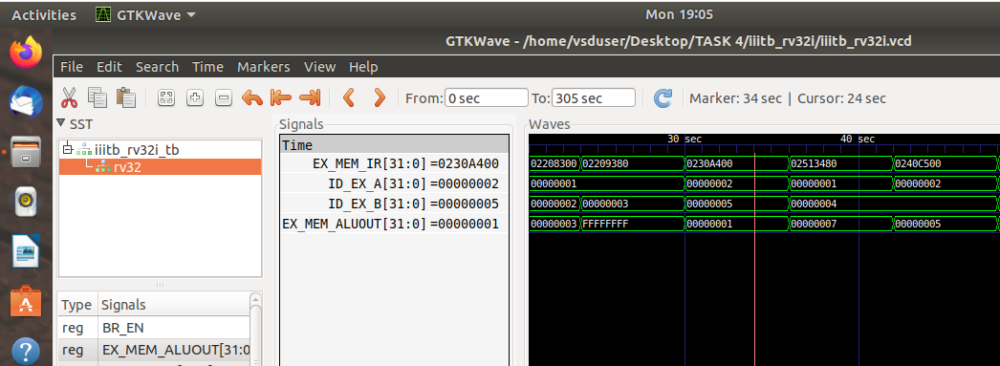
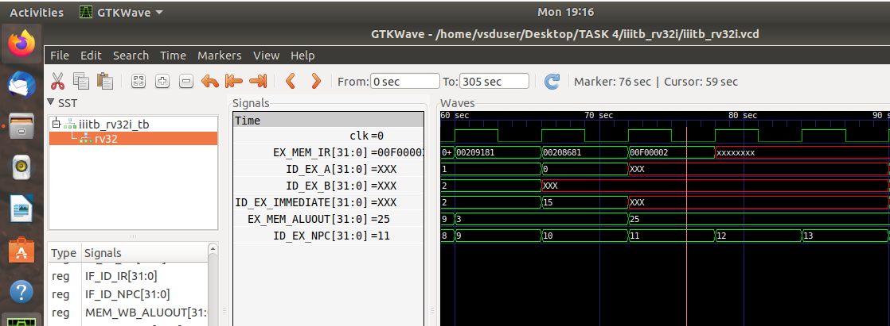
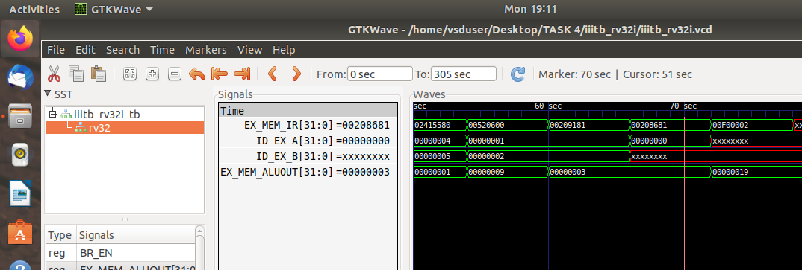
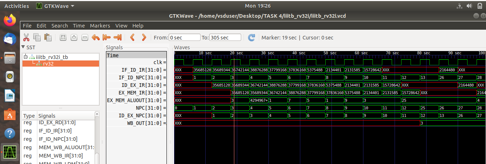

# Functional Simulation of RISC-V Core
---

### 4.1 About Iverilog and GTKWave
This is the GTKWave interface showing all signal waveforms, including values of registers and control signals.

**Icarus Verilog** is an implementation of the Verilog hardware description language.  
**GTKWave** is a fully featured GTK+ v1.2 based wave viewer for Unix and Win32 which reads Verilog Structural Verilog Compiler generated AET files as well as standard Verilog VCD/EVCD files and allows their viewing.

**Waveform Representation:**  
The GTKWave window will display the signals, showing how each instruction and register value changes over time.

### 4.2 Installing Iverilog and GTKWave

### For Ubuntu:

Open your terminal and type the following to install Iverilog and GTKWave:

```bash
$ sudo apt-get update
$ sudo apt-get install iverilog gtkwave
```
To clone the repository and download the netlist files for simulation:

```bash
$ git clone https://github.com/vinayrayapati/iiitb_rv32i
$ cd iiitb_rv32i
```

To simulate and run the Verilog code, enter the following commands in your terminal:

```bash
$ iverilog -o iiitb_rv32i iiitb_rv32i.v iiitb_rv32i_tb.v
$ ./iiitb_rv32i
```

To see the output waveform in GTKWave, enter the following commands:

```bash
$ gtkwave iiitb_rv32i.vcd
```



----

### 4.3 INSTRUCTION SET OF RISC-V RV32I

This document provides a summary of the **RISC-V RV32I instruction set**, categorized into three main types of instructions based on their functionality.

#### 1. Computational Instructions (9 Instructions)
These instructions perform arithmetic and logical operations.

- **Instructions**:
  - `add`, `addi`, `sub`:
    - Perform addition or subtraction.
    - For `addi`, the immediate value is a 12-bit signed value.
  - `sll`, `srl`:
    - Perform logical left and right shifts.
  - `and`, `or`, `xor`:
    - Perform bitwise operations.
  - `slt`:
    - (Set less than) Sets the destination register to `1` if the first operand is less than the second operand.

- **Functionality**:
  These instructions manipulate data in registers, performing basic math and bitwise operations essential for computations.

#### 2. Control Flow Instructions (2 Instructions)
These instructions control the program flow through conditional branching.

- **Instructions**:
  - `beq`, `bne`:
    - Branch if equal or branch if not equal.

- **Functionality**:
  - Compares values and, if the condition is satisfied, transfers control to the address offset provided in the 12-bit signed immediate value.
  - Useful for implementing loops and conditional execution.

#### 3. Memory Access Instructions (2 Instructions)
These instructions handle data transfer between memory and registers.

- **Instructions**:
  - `lw`: Load a 32-bit word from memory into the destination register.
  - `sw`: Store a 32-bit word from a register into memory.

- **Functionality**:
  - Essential for loading data into registers for computations and storing results back into memory.

#### Summary
The RISC-V RV32I instruction set forms the foundation of the RV32I architecture, supporting:
- Basic arithmetic and logic operations,
- Branching for control flow,
- Memory operations for data handling.

This lightweight and versatile instruction set is a core component of RISC-V-based systems.



---
### 4.4 RISC-V RV32I Instruction Memory Initialization

This document provides an overview of the **Verilog memory initialization for RISC-V RV32I instructions**, categorized based on their functionality.

#### Verilog Code

The following code initializes a memory block (`MEM`) with RISC-V RV32I machine instructions.



#### RISC-V RV32I Instruction Tables

#### 1. Computational Instructions

| **Instruction** | **Hex Code**   | **Description**                         |
|------------------|----------------|-----------------------------------------|
| `add`           | `0x02208300`   | Adds `r1` and `r2`, stores in `r6`.     |
| `sub`           | `0x02209380`   | Subtracts `r2` from `r1`, stores in `r7`. |
| `and`           | `0x0230a400`   | Bitwise AND of `r1` and `r3`, stores in `r8`. |
| `or`            | `0x02513480`   | Bitwise OR of `r2` and `r5`, stores in `r9`. |
| `xor`           | `0x0240c500`   | Bitwise XOR of `r1` and `r4`, stores in `r10`. |
| `slt`           | `0x02415580`   | Sets `r11` to `1` if `r2 < r4`.         |
| `addi`          | `0x00520600`   | Adds immediate `5` to `r4`, stores in `r12`. |

---

#### 2. Control Flow Instructions

| **Instruction** | **Hex Code**   | **Description**                         |
|------------------|----------------|-----------------------------------------|
| `beq`           | `0x00f00002`   | Branch to address `15` if `r0 == r0`.   |
| `bne`           | `0x01409002`   | (Commented) Branch to address `20` if `r0 != r1`. |

---

#### 3. Memory Access Instructions

| **Instruction** | **Hex Code**   | **Description**                         |
|------------------|----------------|-----------------------------------------|
| `lw`            | `0x00208681`   | Loads word from memory address `r1+2` into `r13`. |
| `sw`            | `0x00209181`   | Stores word from `r3` into memory address `r1+2`. |

---

#### Commented Instructions

| **Instruction** | **Hex Code**   | **Description**                         |
|------------------|----------------|-----------------------------------------|
| `addi`          | `0x00520601`   | Adds immediate `5` to `r4`, stores in `r12`. |
| `sll`           | `0x00208783`   | Performs a logical left shift on `r1` by `r2`. |
| `srl`           | `0x00271803`   | Performs a logical right shift on `r14` by `r2`. |

#### Explanation of Each Line

##### Purpose
The memory (`MEM`) is used to store machine instructions, which are then fetched, decoded, and executed in a processor pipeline.

##### Instruction Details
Each line specifies a 32-bit instruction in hexadecimal format, along with a comment explaining the operation (in RISC-V assembly format).

##### Initialization
The instructions are loaded into specific memory addresses at the positive edge of the `RN` signal (possibly a reset signal).

---

### 4.5 The output waveforms

#### ADDI R12, R4, 5
This instruction adds the immediate value 5 to the contents of register R4 and stores the result in register R12.

**Waveform Representation:**  
The value of R4 will be incremented by 5, and the result will be stored in R12.

   

   ---
   
  #### ADD R6, R2, R1
This instruction adds the values of registers R2 and R1, storing the result in register R6.

**Waveform Representation:**  
The sum of R2 and R1 will be displayed on the waveform, and the result will be reflected in R6.

 

 ---

#### AND R8, R1, R3
This instruction performs a bitwise AND operation on the values in registers R1 and R3 and stores the result in register R8.

**Waveform Representation:**  
The bitwise AND operation between R1 and R3 will be shown, and the result will be in R8.

 

 ---

 #### BEQ R0, R0, 15
The BEQ (branch if equal) instruction checks if the contents of registers R0 and R0 are equal (which they always are, since R0 is hardwired to zero). If they are, it will branch 15 instructions ahead.

**Waveform Representation:**  
The branch condition will be evaluated and, since R0 equals R0, it will trigger a jump in the instruction sequence.


---

#### BNE R0, R0, 15
The BNE (branch if not equal) instruction checks if R0 and R0 are not equal. Since R0 is always zero, this branch will not be taken.

**Waveform Representation:**  
Similar to BEQ, the condition is evaluated, but since it’s not true, the program continues to the next instruction.



---

#### LW R13, R1, 2
This instruction loads a word from memory at the address computed by adding 2 to the contents of R1 and stores the result in register R13.

**Waveform Representation:**  
The address calculation, memory access, and data loading into R13 will be shown.



---

#### OR R9, R2, R5
This instruction performs a bitwise OR operation between the values of registers R2 and R5 and stores the result in register R9.

**Waveform Representation:**  
The OR operation will be displayed, and the result will be placed in R9.


---

#### SLT R1, R2, R4
This instruction performs a set-less-than operation. It compares the values of R2 and R4, and if R2 is less than R4, it sets R1 to 1, otherwise 0.

**Waveform Representation:**  
The comparison result will be displayed in R1, either 1 or 0, depending on whether R2 is less than R4.


---

#### SUB R7, R1, R2
This instruction subtracts the value in register R2 from the value in register R1 and stores the result in register R7.

**Waveform Representation:**  
The difference between R1 and R2 will be calculated and stored in R7.


---

#### SW R3, R1, 2
This instruction stores the word from register R3 into memory at the address computed by adding 2 to the value in R1.

**Waveform Representation:**  
The address calculation, memory store, and data being written to memory will be shown.


---

#### XOR R10, R1, R4
This instruction performs a bitwise XOR operation on the values in registers R1 and R4 and stores the result in register R10.

**Waveform Representation:**  
The bitwise XOR operation will be shown, and the result will be placed in R10.


---

#### Full 5-Stage Instruction Pipeline and PC Increment Description
This is a representation of the entire 5-stage instruction pipeline in a processor (IF, ID, EX, MEM, WB). It shows how each stage of the instruction lifecycle proceeds, as well as the program counter (PC) incrementing.

**Waveform Representation:**  
The pipeline stages will show the progression of the instruction through each stage, and the PC value will increment at the correct times.



---

