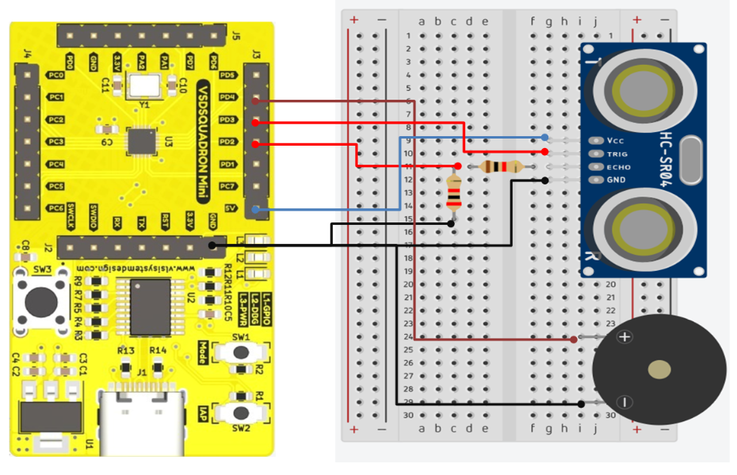

# Ultrasonic Obstacle Detection Circuit using VSDSquadron Mini

## **Overview**  
The **Ultrasonic Blind Stick** project integrates an **ultrasonic sensor** with the **VSD_Squadron-MINI-BOARD** to assist visually impaired individuals in detecting obstacles. The **HC-SR04 ultrasonic sensor** continuously measures distance and sends signals to the **VSD_Squadron-MINI-BOARD**. When an obstacle is detected within a **50 cm** range, an **active buzzer** is triggered to alert the user.  
      This project interfaces an **HC-SR04 Ultrasonic Sensor** and a **2-Pin Active Buzzer** with the **CH32V00x Microcontroller**. The system measures distance using the ultrasonic sensor and triggers the buzzer when an object is detected within a certain range.

## **Components Required**  
- **VSD_Squadron-MINI-BOARD**  
- **Ultrasonic Sensor (HC-SR04)**  
- **Active Buzzer**  
- **Battery**  
- **Breadboard**  
- **Jumper Wires**  

## **Circuit Connection**  

The **HC-SR04 ultrasonic sensor** is connected to the **VSD_Squadron-MINI-BOARD** as follows:  
- **VCC (Power) → 5V pin** on the VSD_Squadron-MINI-BOARD  
- **GND (Ground) → GND pin** on the board  
- **Trigger Pin → GPIO PD3** (Sends ultrasonic pulse)  
- **Echo Pin → GPIO PD2** (Receives reflected signal)  

The **active buzzer** is connected to the **VSD_Squadron-MINI-BOARD** as follows:  
- **VCC → 3.3V or 5V pin** on the board  
- **GND → GND pin**  
- **Signal Pin → GPIO PD4** (Used to activate the buzzer)  

## 📌 **Pin Connections**

### **1️⃣ Ultrasonic Sensor (HC-SR04)**
| **Sensor Pin** | **CH32V00x Pin** | **Description** |
|---------------|----------------|----------------|
| **VCC**       | **5V**          | Power Supply  |
| **GND**       | **GND**         | Ground        |
| **TRIG**      | **PD3**         | Trigger Signal (Output) |
| **ECHO**      | **PD2** (via Resistor Divider) | Echo Response (Input) |

⚠ **Voltage Divider Required for ECHO Pin** (5V → 3.3V)  
- **1kΩ resistor** between **ECHO (5V) and PD2**  
- **2kΩ resistor** between **PD2 and GND**  

### **2️⃣ Buzzer (2-Pin Active)**
| **Buzzer Pin**  | **CH32V00x Pin** | **Description** |
|----------------|----------------|----------------|
| **Positive (+)** | **PD4**        | Buzzer Control (Output) |
| **Negative (-)** | **GND**        | Ground |

## 📌 Circuit Breakdown
1️⃣ **Ultrasonic sensor (HC-SR04) measures distance and sends data via Echo (PD2).**  
2️⃣ **Buzzer (PD4) gets activated when an obstacle is detected within range.**  
3️⃣ **Resistors prevent excessive current and floating signals.**  

## Circuit Diagram

